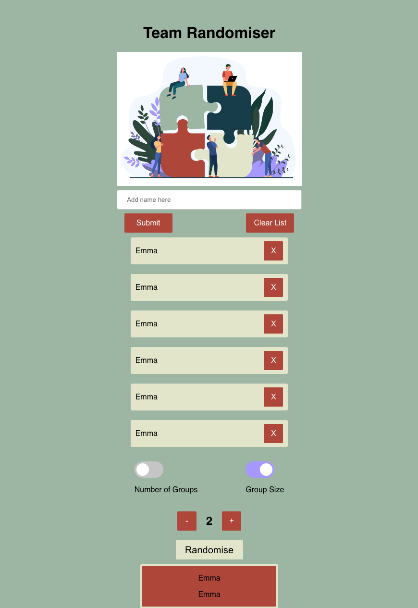

# Team Randomiser

- **About**: A simple team randomiser created in React.js. The app enables you to add members, select either the number of teams or team size and randomise people into groups. The app is fully responsive.
---

## Deployed App [here](https://reflectjournal.netlify.app/) - feel free to check it out 😀



---

## **Installation and Setup Instructions**

Clone down this repository. You will need node and npm installed globally on your machine.

1. Clone the repo from https://github.com/randleem/Team_Randomiser.git

```
git clone https://github.com/randleem/Team_Randomiser.git
cd Team-randomiser
```

2. Install any node modules (you will need node and npm installed globally on your machine):

```
npm install
```

3. Run the front-end server using:

```
npm run start
```

4. Visit the App at:

```
localhost:3000
```

5. To Run the Test Suite:

```
npm run test
```

---

## How to use the app and the user's journey.

1. Add a name to the input box where is says "Add name here", hit the Sumbit button or press enter, the name will appear in the list below.

2. Continue add more members.

3. Once you have added everyone, move the group count up and down using the buttons until you have the number of groups or group size desired.

4. Select either group size or number of groups and hit randomise.

5. You can delete people by hitting the X button next to a name.

6. To re-randomise simply hit the button again.

7. Hit the clear list to clear all names from the list

8. Enjoy

---

## Tech used:

- React.
- CSS.
- HTML.

---

App Created by Emma Randle
